# Team Task Manager Project

## Link to the project
[Team Task Manager](https://team-task-manager-1vun.onrender.com/test-team/)

## User for testing
- Username: test
- Password: 123TEST123

## Description
A comprehensive team task management system built with Django. This application allows teams to organize their work through projects and tasks, with features for task assignment, progress tracking, and team collaboration.

## Features
- **User Authentication**
  - Login/Signup functionality
  - Team-based access control

- **Project Management**
  - Create and manage team projects
  - Set project deadlines
  - Track project progress
  - Project description and details

- **Task Management**
  - Create tasks within projects
  - Assign tasks to team members
  - Set task priorities and deadlines
  - Track task status (Pending/Completed)
  - Task descriptions and comments

- **Team Collaboration**
  - Team-based workspace
  - Message system for team communication
  - Task comments for discussion
  - Team member management

- **Inbox System**
  - Personal message inbox
  - Message archiving
  - Read/Unread status tracking
  - Message filtering and search

## Technology Stack
- **Backend**: Django 4.x
- **Frontend**: 
  - HTML5
  - CSS3
  - Bootstrap 5
  - JavaScript
- **Database**: SQLite/PostgreSQL
- **Additional Libraries**:
  - django-crispy-forms
  - Bootstrap Icons

## Project Structure 

task_manager/
├── manager/ # Project configuration
│ ├── settings.py
│ └── urls.py
├── task_manager/ # Main application
│ ├── models/
│ │ ├── project.py # Project model
│ │ ├── task.py # Task model
│ │ └── message.py # Message model
│ ├── views/
│ │ ├── project.py # Project views
│ │ ├── task.py # Task views
│ │ └── message.py # Message views
│ ├── templates/
│ │ └── task_manager/
│ │ ├── projects/ # Project templates
│ │ ├── tasks/ # Task templates
│ │ └── messages/ # Message templates
│ └── urls.py
└── static/ # Static files
├── css/
└── js/

## Key Models
- **Team**: Represents a team workspace
- **Project**: Contains tasks and team members
- **Task**: Individual tasks within projects
- **Message**: Team communication system
- **User**: Extended Django user model

## Installation
1. Clone the repository

bash
git clone [repository-url]

2. Create virtual environment

bash:README.md
python -m venv venv
source venv/bin/activate # Linux/Mac
venv\Scripts\activate # Windows

3. Install dependencies

bash
pip install -r requirements.txt

4. Apply migrations

bash
python manage.py migrate

5. Create superuser

bash
python manage.py createsuperuser

6. Collect static files

python manage.py collectstatic

7. Run development server

bash
python manage.py runserver

## Usage
1. Create a team workspace
2. Add team members
3. Create projects
4. Add tasks to projects
5. Assign tasks to team members
6. Track progress through the dashboard

## Design Features
- Purple-based color scheme
- Clean and modern UI
- Responsive design
- User-friendly navigation
- Consistent styling across pages

## URL Structure
- `/` - Index/redirect to login
- `/login/` - User login
- `/signup/` - User registration
- `/<team_name>/` - Personal task list
- `/<team_name>/projects/` - Team project list
- `/<team_name>/projects/create` - Create new project
- `/<team_name>/projects/<id>/update` - Update project
- `/<team_name>/projects/<id>/delete` - Delete project
- `/<team_name>/projects/<id>/` - Team project detail
- `/<team_name>/projects/<id>/create` - Create new task
- `/<team_name>/projects/<id>/<task_id>/` - Task detail
- `/<team_name>/projects/<id>/<task_id>/update` - Update task
- `/<team_name>/projects/<id>/<task_id>/delete` - Delete task
- `/<team_name>/messages/` - Team inbox
- `/<team_name>/messages/create` - Create new message
- `/<team_name>/messages/<id>/detail` - Message detail

## Page screenshots

### Sign Up Page
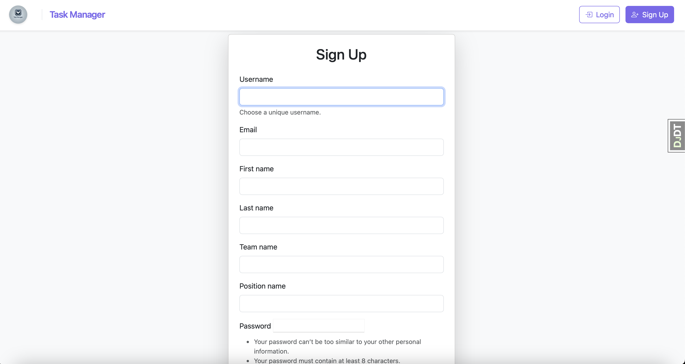

### Login Page
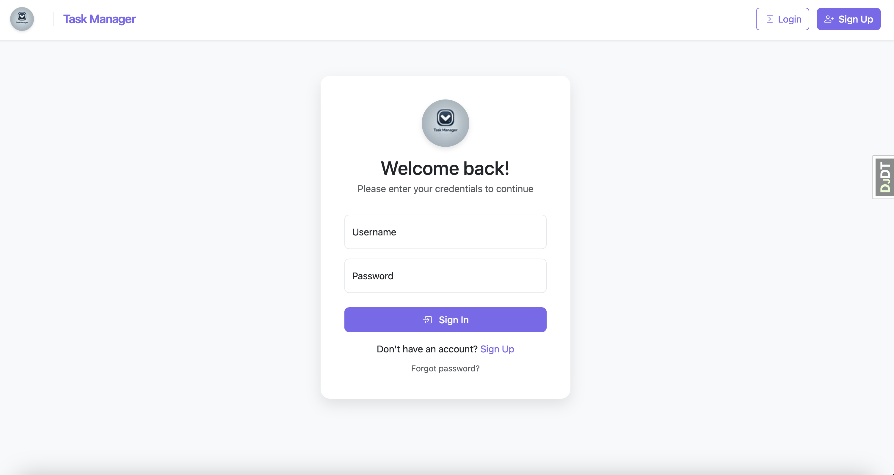

### Team Project List Page
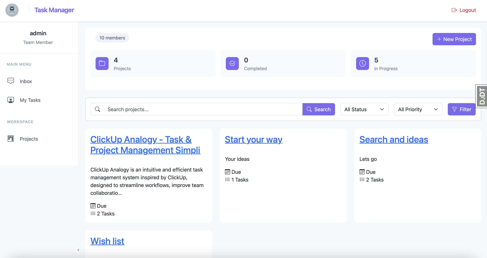

### Team Project Detail Page
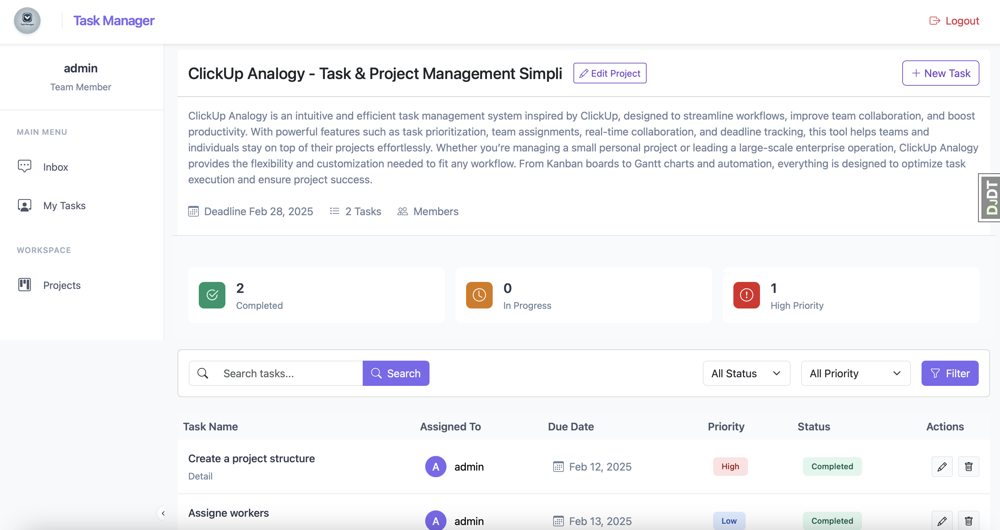

### Team Project Create Page
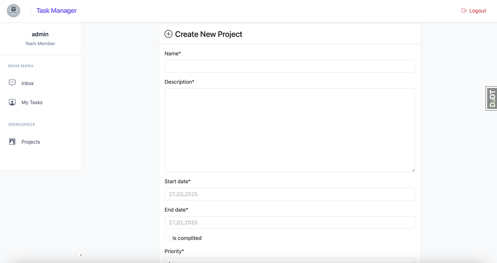

### Team Project Update Page
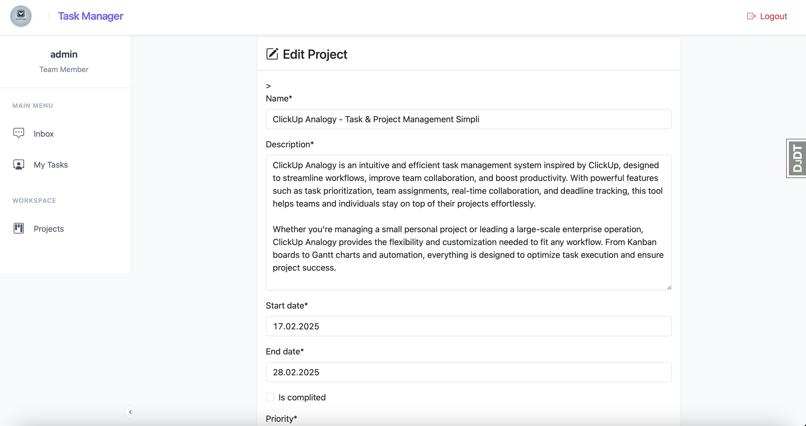

### Team Project Delete Page
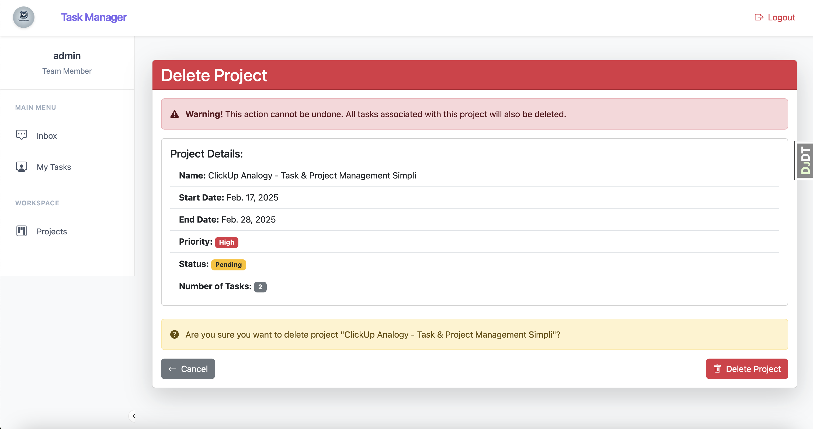

### Personal Task List Page
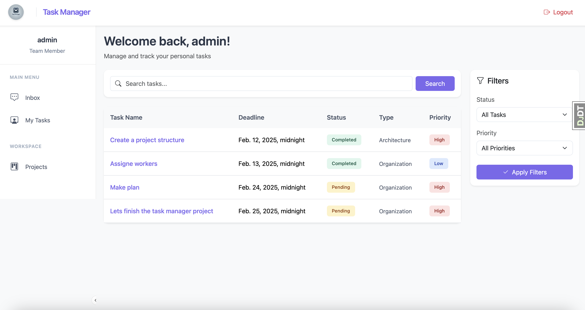

### Task Detail Page
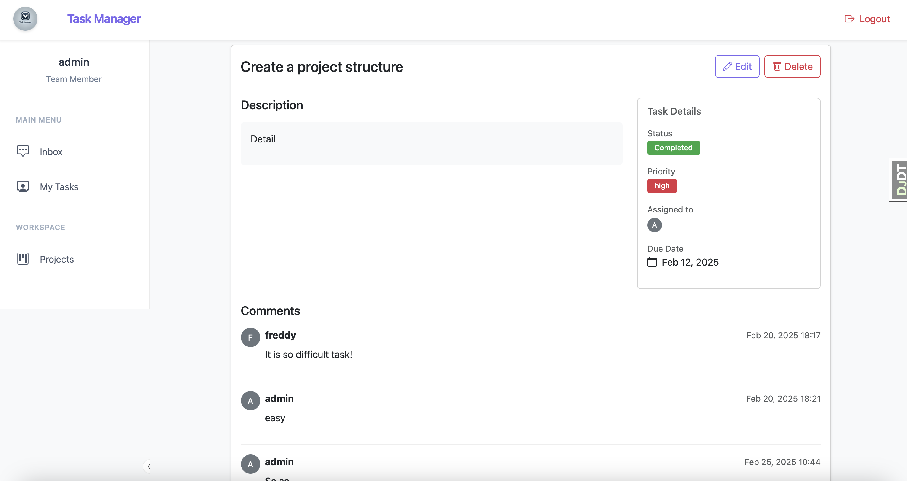

### Task Create Page
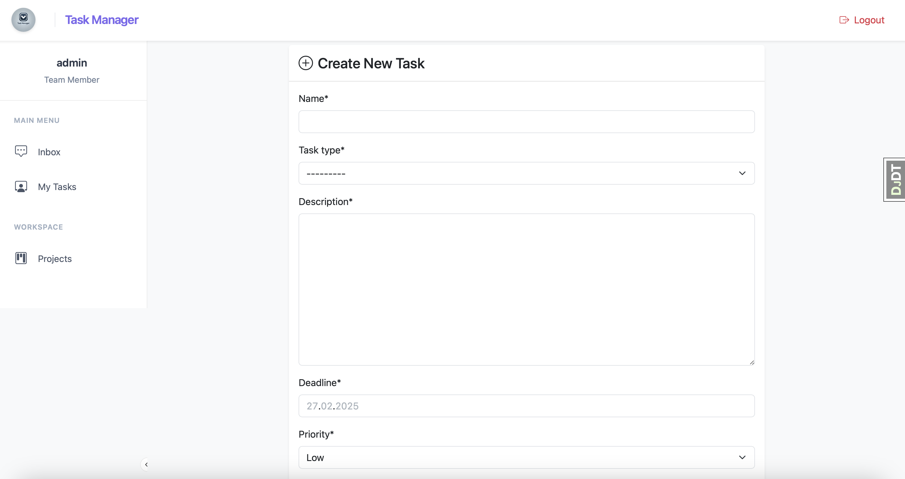

### Task Update Page
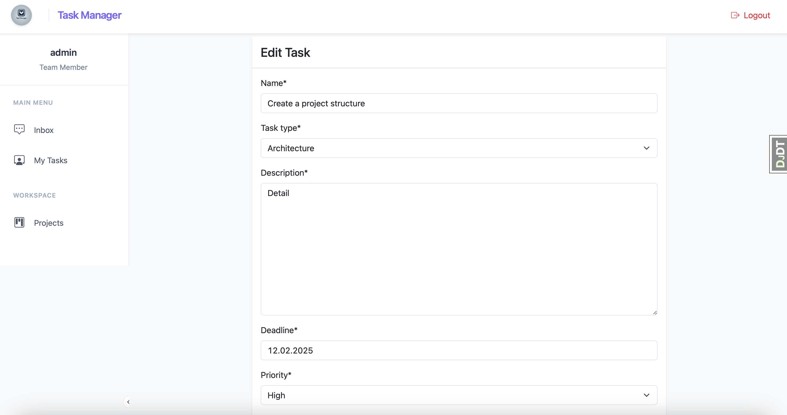

### Task Delete Page
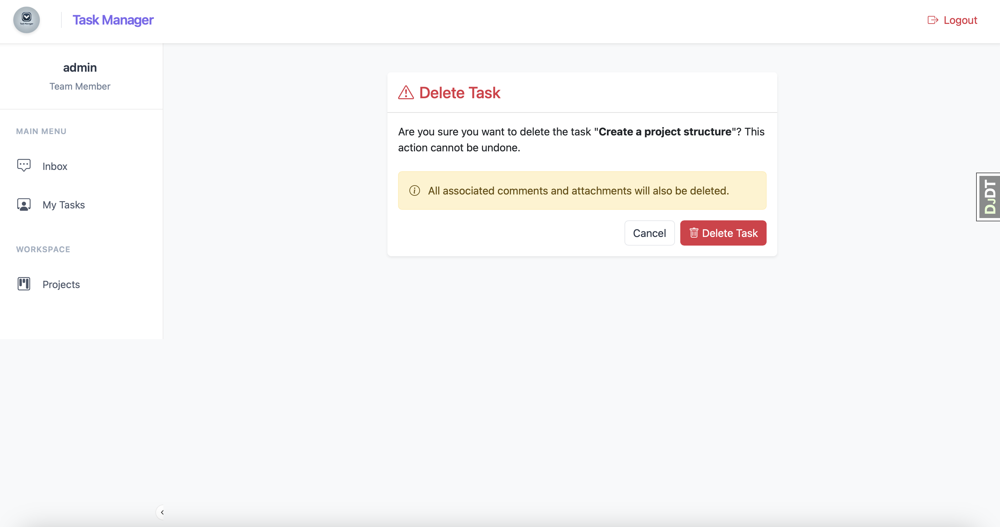

### Message List Page
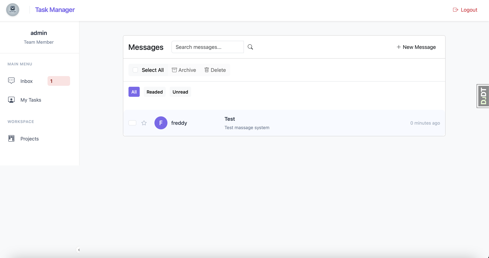

### Message Detail Page
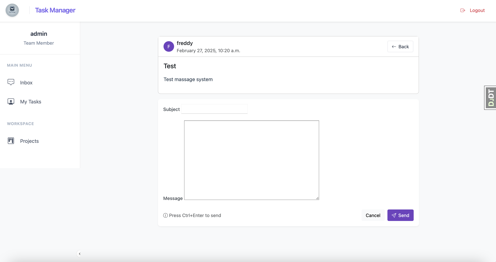

### Message Create Page
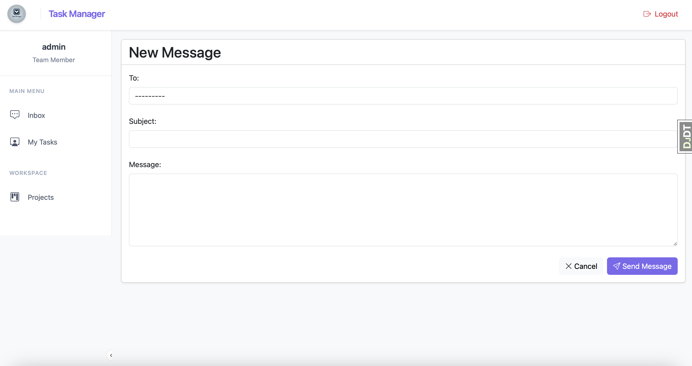

### Message Delete Page
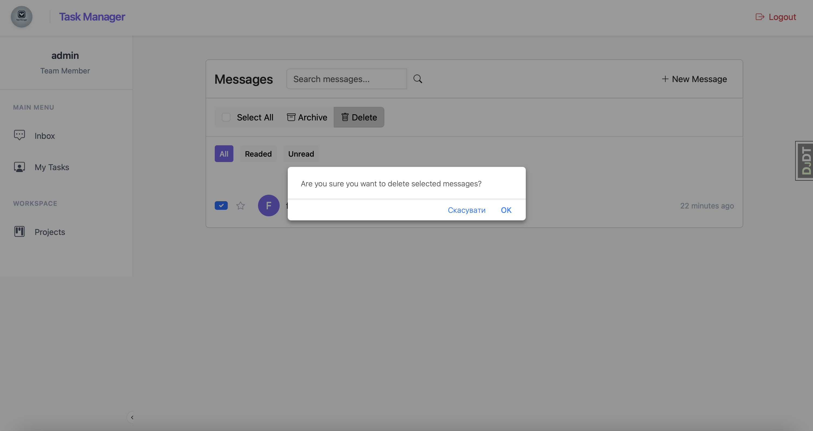

## Future Improvements
- Task priority levels
- File attachments
- Team chat system
- Calendar integration
- Email notifications
- Mobile application
